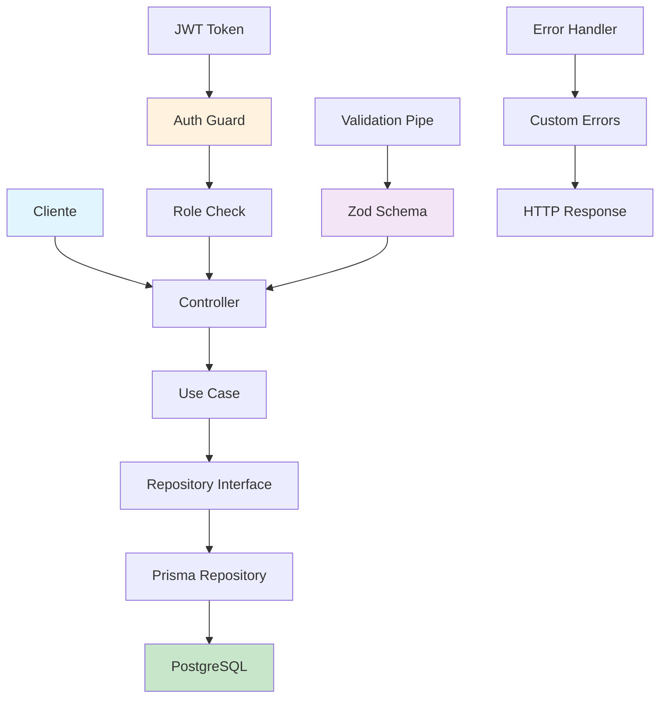

# 🏥 Clinic API - Sistema de Gestão Clínica

> **API RESTful para a gestão de uma clinica de estética, construída com NestJS e arquitetura limpa**

[](https://github.com/seu-usuario/clinic-api)
[](LICENSE)

## 📋 Índice

- [Sobre o Projeto](#-sobre-o-projeto)
- [🚀 Tecnologias e Arquitetura](#-tecnologias-e-arquitetura)
- [📊 Cobertura de Testes](#-cobertura-de-testes)
- [📚 Documentação da API](#-documentação-da-api)
- [🏗️ Estrutura do Projeto](#️-estrutura-do-projeto)
- [🔄 Fluxo da Aplicação](#-fluxo-da-aplicação)
- [⚡ Como Executar](#-como-executar)
- [🧪 Executando Testes](#-executando-testes)
- [📈 Funcionalidades](#-funcionalidades)
- [🔐 Autenticação e Autorização](#-autenticação-e-autorização)
- [💾 Banco de Dados](#-banco-de-dados)
- [🚀 Deploy](#-deploy)
- [🤝 Contribuindo](#-contribuindo)
- [📄 Licença](#-licença)

## 🎯 Sobre o Projeto

Este projeto demonstra uma **API RESTful completa** para gestão de clínicas estéticas, implementando **Clean Architecture** e **Domain-Driven Design**. O sistema gerencia usuários, procedimentos médicos e agendamentos com validações robustas e tratamento de erros .

### ✨ Destaques Técnicos

- **Arquitetura Limpa** com separação clara de responsabilidades
- **Testes automatizados** com cobertura superior a 95%
- **Validação de dados** com Zod e pipes customizados
- **Autenticação JWT** com estratégias de autorização
- **Migrations automáticas** com Prisma ORM
- **CI/CD pipeline** com GitHub Actions
- **Documentação interativa** com Scalar

## 🚀 Tecnologias e Arquitetura

### 🏗️ Backend

- **NestJS** - Framework Node.js para aplicações escaláveis
- **TypeScript** - Tipagem estática e desenvolvimento robusto
- **Prisma** - ORM moderno com migrations automáticas
- **PostgreSQL** - Banco de dados relacional robusto

### 🧪 Testes

- **Vitest** - Framework de testes rápido e moderno
- **Supertest** - Testes de integração HTTP
- **Faker.js** - Geração de dados de teste realistas

### 🔧 Ferramentas

- **Docker** - Containerização da aplicação
- **pnpm** - Gerenciador de pacotes eficiente
- **GitHub Actions**

### 🎨 Arquitetura

```
src/
├── core/           # Entidades e regras de negócio
├── domain/         # Casos de uso e lógica de aplicação
├── infra/          # Implementações concretas (DB, HTTP)
└── main.ts         # Ponto de entrada da aplicação
```

## 📊 Cobertura de Testes

|  |  |
|---|---|


- **Testes Unitários**: Cobertura superior a 95%
- **Testes E2E**: Validação completa dos fluxos de negócio
- **Pipeline CI/CD**: Execução automática em cada push

## 📚 Documentação da API ( Swagger + Scalar )

|  |  |
|---|---|
|  |  |


## 📌 Rotas da API

| Método | Rota | Descrição | Autenticação |
| ------ | ---- | --------- | ------------ |
| **`POST`** 🟢 | `/users` | Cadastro de usuário | 🔓 Pública |
| **`POST`** 🟢 | `/session` | Autenticação | 🔓 Pública |
| **`POST`** 🟢 | `/appointments` | Criar agendamento | 🔐 JWT |
| **`GET`** 🔵 | `/appointments` | Listar agendamentos | 🔐 JWT |
| **`PATCH`** 🟡 | `/appointments/confirm` | Confirmar agendamento | 🔐 JWT |
| **`PATCH`** 🟡 | `/appointments/cancel` | Cancelar agendamento | 🔐 JWT |
| **`GET`** 🔵 | `/appointments/{userId}` | Listar agendamentos de um usuário | 🔐 JWT |
| **`PATCH`** 🟡 | `/appointments/{appointmentId}/reschedule` | Reagendar agendamento | 🔐 JWT |
| **`POST`** 🟢 | `/procedures` | Criar procedimento | 🔐 JWT |
| **`GET`** 🔵 | `/procedures` | Listar procedimentos | 🔐 JWT |
| **`PATCH`** 🟡 | `/procedures` | Editar procedimento | 🔐 JWT |
| **`GET`** 🔵 | `/procedures/{userId}` | Listar procedimentos de um usuário | 🔐 JWT |


## 🏗️ Estrutura do Projeto

```
clinic-api/
├── src/
│   ├── core/                    # Camada de domínio
│   │   ├── entities/           # Entidades de negócio
│   │   ├── errors/             # Erros customizados
│   │   └── types/              # Tipos utilitários
│   ├── domain/                 # Casos de uso
│   │   ├── management/         # Lógica de negócio
│   │   │   ├── application/    # Casos de uso
│   │   │   └── enterprise/     # Entidades
│   ├── infra/                  # Infraestrutura
│   │   ├── auth/               # Autenticação JWT
│   │   ├── database/           # Prisma e repositórios
│   │   ├── http/               # Controllers e middlewares
│   │   └── env/                # Configurações
│   └── main.ts                 # Aplicação principal
├── test/                       # Testes automatizados
├── prisma/                     # Schema e migrations
└── .github/workflows/          # CI/CD pipeline
```

## 🔄 Fluxo da Aplicação



## ⚡ Como Executar

### 📋 Pré-requisitos

- Node.js 18+
- pnpm 8+
- Docker e Docker Compose
- PostgreSQL (opcional, Docker recomendado)

### 🚀 Instalação

```bash
# Clone o repositório
git clone https://github.com/seu-usuario/clinic-api.git
cd clinic-api

# Instale as dependências
pnpm install

# Configure as variáveis de ambiente
cp .env.example .env
# Edite o arquivo .env com suas configurações

# Gere o cliente Prisma
npx prisma generate

# Inicie o banco de dados
docker-compose up -d

# Execute as migrations
npx prisma migrate dev

# Inicie a aplicação
pnpm run start:dev
```

## 🧪 Executando Testes

```bash
# Testes unitários
pnpm run test

# Testes em modo watch
pnpm run test:watch

# Testes com cobertura
pnpm run test:cov

# Testes E2E
pnpm run test:e2e
```

## 📈 Funcionalidades

### 👥 Gestão de Usuários

- ✅ Cadastro com validação de email único
- ✅ Autenticação JWT segura
- ✅ Hash de senhas com bcrypt
- ✅ Controle de roles (ADMIN, USER)

### 📅 Agendamentos

- ✅ Criação de agendamentos
- ✅ Confirmação e cancelamento
- ✅ Reagendamento com validações
- ✅ Filtros por usuário e período

### 🏥 Procedimentos Médicos

- ✅ Cadastro de procedimentos
- ✅ Edição e consulta
- ✅ Associação com usuários
- ✅ Validações de dados

## 🔐 Autenticação e Autorização

- **JWT Strategy**: Tokens seguros com expiração configurável
- **Guards Customizados**: Proteção de rotas sensíveis

## 💾 Banco de Dados

### 🗄️ Schema Principal

- **Users**: Gestão de usuários e perfis
- **Appointments**: Agendamentos e status
- **Procedures**: Procedimentos médicos

### 🔄 Migrations

- **Prisma Migrate**: Controle de versão do banco
- **Rollbacks**: Reversão segura de mudanças


## 🏆 Conquistas Técnicas

- **Clean Architecture**: Separação clara de responsabilidades
- **SOLID Principles**: Código limpo e manutenível
- **Error Handling**: Tratamento de erros
- **Type Safety**: TypeScript em 100% do código

## 📄 Licença

Este projeto está sob a licença MIT. Veja o arquivo [LICENSE](LICENSE) para mais detalhes.

---

## 👨‍💻 Sobre o Desenvolvedor

**Desenvolvedor Backend Junior** apaixonado por código limpo, arquitetura escalável e boas práticas de desenvolvimento. Este projeto demonstra habilidades em:

- **NestJS** e **Node.js**
- **Arquitetura de Software**
- **Testes Automatizados**
- **Banco de Dados Relacionais**
- **APIs RESTful**
- **DevOps e CI/CD**

---

<div align="center">
  <p>⭐ Se este projeto te ajudou, considere dar uma estrela!</p>
  <p>📧 Contato: otaviosk59@gmail.com</p>
  <p>🔗 LinkedIn: https://www.linkedin.com/in/otavio-takaki </p>
</div>
